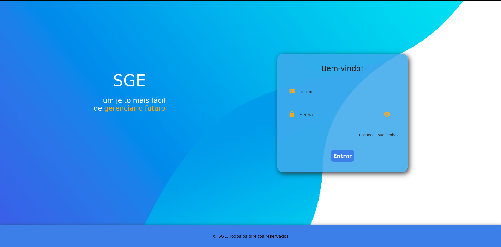

## SGE - Sistema de Gestão Escolar

* Sistema voltado ao gerenciamento de alunos e funcionários de uma instituição escolar.
* Este projeto está sendo desenvolvido como forma de estudo sobre PHP.
* Sempre que adicionar algo novo irei atualizar as images desse README.

   * Versão Atual:
   * Uso de SESSION no formulário de login

   

        
        
   
